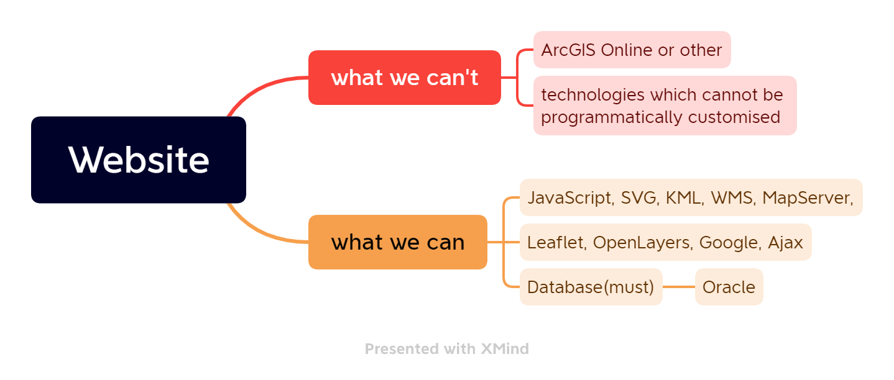

# Quiter
the web application of noise

## Guide

- the project link: https://github.com/CGSP-6/Quiter 
- the web site link: https://www.geos.ed.ac.uk/~s2288848/cgsp/Quiter/ 
- Given that this is a private project now, we won't have a website page probided by github. and the only way to show the web is put this in the web path of the school's path.
## Restrictions

We need use pure website development methods.
and here a the words copy from the guide **(reference 1)**:

- Web mapping should involve **python programming**, combined with whichever other
technologies you see as most appropriate( **JavaScript, SVG, KML, WMS, MapServer,
Leaflet, OpenLayers, Google, Ajax, etc.**).
- You **should not use ArcGIS Online** or other
technologies which cannot be programmatically customised. **Your report should justify the
technologies used.**
- You must use a database management system (**Oracle**) to store some of the attribute data
involved. You can store x and y coordinates as number fields, but you should NOT try to
store any more complex spatial data in Oracle(that is too much at this stage, and will feature in the Advanced Spatial Database Management course in Semester Two).
### Records of tools
1. [fontawesome](https://fontawesome.com/kits/d9dae18b78/use?welcome=yes)
## Interactions
This is how these technologies work with each other.

## For developers:
### Learning Materials
look this
### work flow
1. coding
2. open xrdp.geos.ed.ac.uk
3. git pull to refersh the website
## Structure

- index.html is the main html
- folders
  - **res**: this folder store images(e.g.icon) and the recording file for test
    - more recording file should on database
  - page: for navigation bar(which is on the top of the page), that means this will expand the page of our website, the pages like intro(tell someting about noise),about(tell the info about our group),should on this page.
  - **doc**(Shiqi will use the vue-press to write the manual about this web site)
    - see more details on the doc/readme.md file
    - the doc file is on for the document. you can edit the doc/docs/readme.md file and others.
  - database(just store some information about the database, we need a real database for it)
## Preview

TODO get a desktop version png here.
  # Reference (click them!)
  1. [the school guide.](https://www.geos.ed.ac.uk/~bmg/teaching/rppp/week3/Capital%20Greenspaces%20Project.pdf)
  2. 
